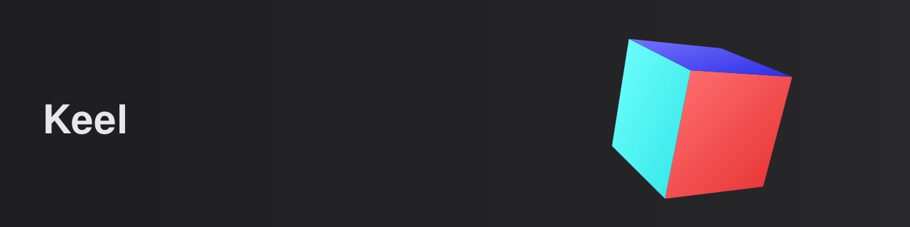

# Keel

<p align="center">
  
</p>

[](LICENSE)
[](https://github.com/nihalantiir/keel-vk/releases)
[](https://github.com/nihalantiir/keel-vk/actions/workflows/ci.yml)
[](#prerequisites)
[](#stack)
[](#stack)

A C++20 Vulkan 1.3 engine scaffold. Successor to
[simple-vk](https://github.com/nihalantiir/simple-vk). A perspective,
depth-tested cube with hue-phased faces, drawn indirect, with an optional
Dear ImGui debug overlay. Setup for games and later systems to build on top
of, not a game itself.

## Stack

- **C++20**
- **SDL3**, windowing, input, surface creation
- **Volk**, Vulkan function loading
- **VMA** (Vulkan Memory Allocator), GPU memory allocation
- **GLM**, math
- **Dear ImGui**, debug overlay (vendored, see [Libraries](https://github.com/nihalantiir/keel-vk/wiki/Libraries))

SDL3/volk/VMA/GLM ship inside the Vulkan SDK, so there's nothing to fetch
or vendor for those four.

## Prerequisites

- [Vulkan SDK](https://vulkan.lunarg.com/) installed, with `VULKAN_SDK` set
- CMake >= 3.24 and [Ninja](https://ninja-build.org/)
- A C++20 compiler (MSVC, Clang, or GCC)
- Internet access on first configure (Dear ImGui is fetched via CMake,
  unless `KEEL_VK_IMGUI=OFF`)

## Building

```
./scripts/build.ps1 [Debug|Release|RelWithDebInfo]   # Windows
./scripts/build.sh [Debug|Release|RelWithDebInfo]    # Linux
```

Or with [CMake presets](CMakePresets.json): `cmake --preset debug && cmake --build --preset debug`.
The executables, `SDL3.dll` (Windows), and compiled shaders all land in
`build/<preset>/bin/`.

### Building without Dear ImGui

`KEEL_VK_IMGUI` CMake option (default `ON`). `OFF` skips fetching Dear
ImGui, no network needed at configure, `src/debug/` isn't compiled:

```
cmake --preset debug -DKEEL_VK_IMGUI=OFF
cmake --build --preset debug
```

The cube still renders, just without the overlay.

### Shipping a build

```
cmake --preset ship
cmake --build --preset ship
```

Equivalent to `-DCMAKE_BUILD_TYPE=Release -DKEEL_VK_IMGUI=OFF`.

## Cleaning

```
./scripts/clean.ps1   # Windows
./scripts/clean.sh    # Linux
```

## Project structure

```
keel-vk/
├── CMakeLists.txt
├── CMakePresets.json
├── CHANGELOG.md
├── external/             vendored deps (Dear ImGui, fetched by CMake)
├── packages/             reserved for a future content-pack format
├── scripts/              build/clean helpers for both platforms
├── shaders/              GLSL sources, compiled to SPIR-V at build time
├── .github/workflows/    CI (configure + build, both ImGui on and off)
└── src/
    ├── keel-vk/          Vulkan + SDL bootstrap: Window, VulkanContext, Swapchain, ShaderModule, ...
    ├── renderer/         the cube: pipeline, depth, indirect draw, rotation, color phase
    ├── debug/            Dear ImGui overlay, gated by KEEL_VK_IMGUI
    ├── client/           the cube executable (keel-vk)
    ├── server/           headless stub, no Vulkan dependency, reserved for keel-net
    └── samples/          reserved for future standalone samples
```

`src/keel-vk/` stays generic, `src/renderer/` builds on it to draw,
`src/debug/` overlays introspection on top. See
[Architecture](https://github.com/nihalantiir/keel-vk/wiki/Architecture).

## Documentation

Deeper docs live on the [wiki](https://github.com/nihalantiir/keel-vk/wiki):

- [Home](https://github.com/nihalantiir/keel-vk/wiki)
- [Build](https://github.com/nihalantiir/keel-vk/wiki/Build)
- [Architecture](https://github.com/nihalantiir/keel-vk/wiki/Architecture)
- [Vulkan bootstrap](https://github.com/nihalantiir/keel-vk/wiki/Vulkan-bootstrap)
- [Device contract](https://github.com/nihalantiir/keel-vk/wiki/Device-contract)
- [Rendering](https://github.com/nihalantiir/keel-vk/wiki/Rendering)
- [Shaders](https://github.com/nihalantiir/keel-vk/wiki/Shaders)
- [Libraries](https://github.com/nihalantiir/keel-vk/wiki/Libraries)
- [Extending](https://github.com/nihalantiir/keel-vk/wiki/Extending)
- [Coding conventions](https://github.com/nihalantiir/keel-vk/wiki/Coding-conventions)
- [Troubleshooting](https://github.com/nihalantiir/keel-vk/wiki/Troubleshooting)

## License

MIT, see [LICENSE](LICENSE).
